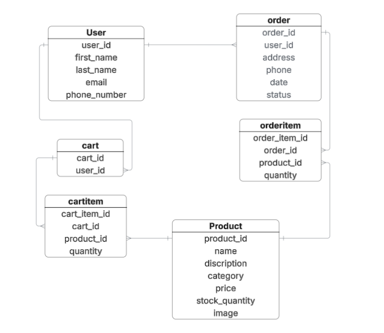

# ✨ GlowHub

---

## 📝 Description

**GlowHub** is an online store where users can browse products by category, search easily, add items to their cart, and place orders.  
Admins can manage the store efficiently by adding, editing, or deleting products through a simple admin interface.  

This project was built to simulate a real-world e-commerce environment, combining backend and frontend logic in a clean and responsive design.

---

## 👥 User Stories

1. As a user, I want to **sign up** and be redirected to the sign-in page.  
2. As a user, I want to **log in** and be redirected to the home page.  
3. As a user, I want to **browse products by category** so I can see what’s available.  
4. As a user, I want to **search for specific products** so I can find them easily.  
5. As a user, I want to **add products to a shopping cart and place orders**.  
6. As an admin, I want to **add, edit, and delete products** so I can manage the store efficiently.  

---

## 📊 Data Model / ERD

---

## 🧾 Attributions

This project was developed using several open-source libraries:

- [**Django**](https://www.djangoproject.com/) – the main backend framework  
- [**asgiref**](https://pypi.org/project/asgiref/) – for ASGI (Asynchronous Server Gateway Interface) support  
- [**Pillow**](https://pypi.org/project/Pillow/) – for handling image uploads and processing  
- [**psycopg2-binary**](https://pypi.org/project/psycopg2-binary/) – PostgreSQL database adapter for Python  
- [**sqlparse**](https://pypi.org/project/sqlparse/) – used by Django for SQL parsing  
- [**tzdata**](https://pypi.org/project/tzdata/) – provides timezone information for accurate datetime handling  

---

## ⚙️ Technologies Used

- **Language:** Python  
- **Framework:** Django  
- **Frontend:** HTML, CSS  
- **Database:** PostgreSQL  
- **Image Handling:** Pillow  
- **Deployment:** Render  

---

## 📸 Screenshots

**Home Page**  

**Cart Page**  

**Admin Panel**  

---

## 💡 Features

- User authentication (sign-up, login, logout)  
- Product browsing by category  
- Search bar for quick product lookup  
- Shopping cart with quantity update and delete options  
- Order placement and management  
- Admin dashboard for CRUD operations  
- Clean, responsive design  

---

## 🔮 Future Improvements

- Add product reviews and ratings  
- Implement payment gateway integration  
- Add a “Favorites” list for users  
- Enhance admin dashboard with analytics and charts
